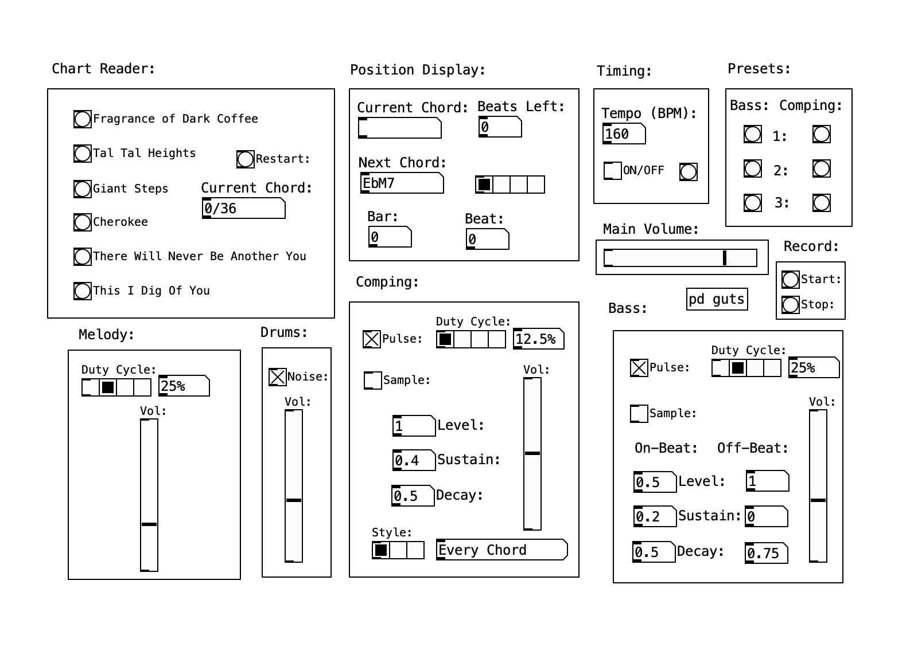

# GameBacking Generator
 PureData patch for algorithmically generating Game Boy style jazz backing tracks

  

# Overview:
 GameBacking Generator is a simple jazz backing track consisting of percussion, bass, and harmony (comping) based on chord changes supplied through a text file. The sound is intended to emulate that of the original Game Boy, featuring pulse waves with adjustable duty cycles and a noise channel for the percussion. Optionally, this patch can also take samples for the comping or bass sounds instead of the pulse waves. In addition, there is support for MIDI input to play a monophonic melody line alongside the generated backing track. Rudimentary recording is implemented with writesf2~ to export .wav files of the generated backing tracks.

# Use:
 To test out the patch, open the project with the main.pd file. 

# Chord Formatting:
 Chords are supplied in the format of "Root Quality Duration", featuring one chord per line in a simple text file (see example chord sheets). Chords are read in the assumption of 4/4 time. Qualities that can be processed include: 
 - M7: Major 7th
 - '7: Dominant 7th
 - m7: Minor 7th
 - m7b5: Minor 7th Flat 5 (Half-Diminished)
 - dim7: Diminished 7th
 - aug7: Augmented 7th
 - '6: 6th
 Durations are then input as an integer representing how many beats that chord will stay for. (e.g. Ab Major 7th for 4 beats would be represented as "Ab M7 4")
 Once a custom chord sheet has been created, simply add it to the /charts/ subdirectory, and add a message with the filename into the "input-reader" subpatch to the main trigger.

# Sample Formatting:
 Samples are added into the /samples/ subdirectory. Formatting is optional, but to load the samples properly you must edit the read objects in the "loading-samples" subpatch under "pd guts". Do not forget to edit the reference pitch either!

 

